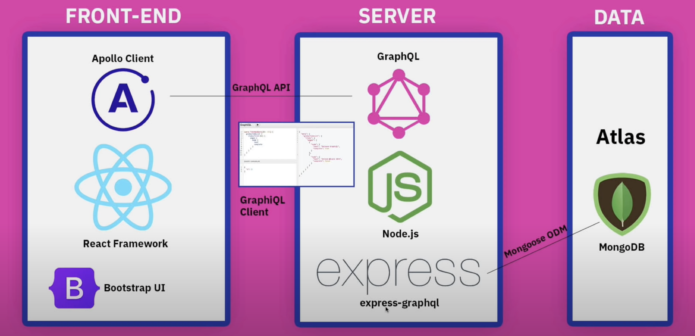
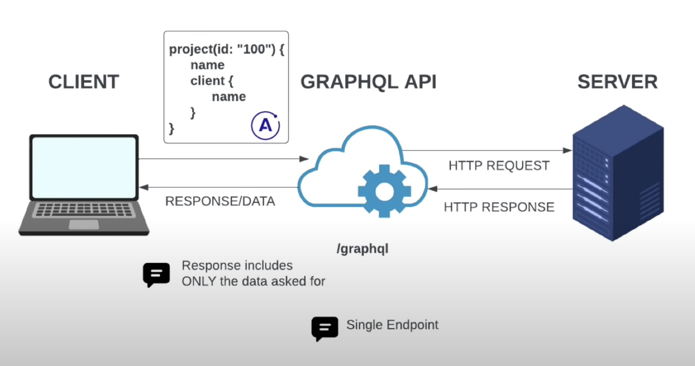
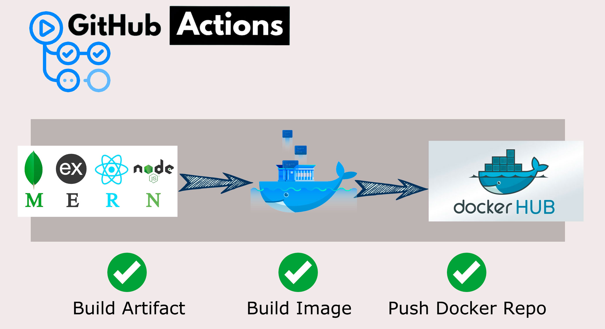

# Project Management (A Dockerize MERN App)

[](https://github.com/mdarif/project-management/actions/workflows/docker.yml) [](https://github.com/mdarif/project-management/actions/workflows/node.js.yml)


<p>
  <a href="https://github.com/git/git-scm.com/blob/main/MIT-LICENSE.txt" target="_blank">
    
  </a>
  <a href="https://twitter.com/arif_iq" target="_blank">
    
  </a>
</p>

> A Dockerize MERN app using Github Actions about Project Management System to add/manage clients & Projects using GraphGL Server/Client.

# Architecture
A Full Stack Dockerize MERN app with GraphQL Server/Client.



### How REST API works?


### How GraphQL API works?



## What is a container?
> A container is the standard unit of software that packages up code and all its dependencies so the application runs quickly and reliably from one computing environment to another.

## Docker Container
A Docker container image is a lightweight, standalone, executable package of software that includes everything needed to run an application: code, runtime, system tools, system libraries and settings. Container images become containers at runtime and in the case of Docker containers — images become containers when they run on Docker Engine.

## Docker Hub
Docker Hub is a cloud-based repository service provided by Docker in which users create, test, store and distribute container images. Through Docker Hub, a user can access public, open-source image repositories, as well as use space to create their own private repositories, automated build functions, webhooks and workgroups.

## Overview
We are going to Dockerize Node.JS, React, and MongoDB into separate containers. Then we are going to use **DOCKER COMPOSE** to run the multi-container application.

At last, from a single command, we can create and start all the services from our configuration.

### Initializing the Project
Clone the GitHub link to a local folder in your computer. Open the folder using VSCode or any text editor of your choice.

### Docker Files
Now, we need to create a Dockerfile for the server and the client. The **Dockerfile **essentially contains the build instructions to build the image.

Let’s start by creating the Dockerfile for the client (our React Frontend).

In the client folder, create a file called **Dockerfile **without any extension.

Write the following lines of code in the file:

#### Dockerfile for React client
```
FROM node:16-buster

# What is Dockerfile?
# Dockerfile describes how to build Docker images, 
# while docker-compose is used to run Docker containers.

# Create an application directory
RUN mkdir -p /usr/src/app

# CD into directory
WORKDIR /usr/src/app

# Copy the app package and package-lock.json file
# COPY package.json /app/package.json
# COPY package-lock.json /app/package-lock.json
COPY package*.json /usr/src/app/

# Install app dependencies
RUN npm install

# RUN mkdir node_modules/.cache && chmod -R 777 node_modules/.cache

# Bundle app source
COPY . /usr/src/app/

EXPOSE 3000

CMD ["npm", "start"]
```

#### Dockerfile for Backend
```
FROM node:16-buster

# What is Dockerfile?
# Dockerfile describes how to build Docker images, 
# while docker-compose is used to run Docker containers.

# Create an application directory
RUN mkdir -p /usr/src/app

# CD into directory
WORKDIR /usr/src/app

# Copy the app package and package-lock.json file
# COPY package.json /app/package.json
# COPY package-lock.json /app/package-lock.json
COPY package*.json /usr/src/app/

# Install app dependencies
RUN npm install

# RUN mkdir node_modules/.cache && chmod -R 777 node_modules/.cache

# Bundle app source
COPY . /usr/src/app/

EXPOSE 3000

CMD [ "npm", "start" ]
```

### Docker Compose
> Compose is a tool for defining and running multi-container Docker applications. With Compose, you use a YAML file to configure your application’s services. Then, with a single command, you create and start all the services from your configuration.

To run our entire application together, i.e run all containers parallelly, we need to configure the docker-compose file.

In the main directory of the project, (outside the server/client) create a file named docker-compose.yml .

Write these contents into the file.

```
version: "3"

services:

  backend:
    # build: server
    build:
      context: ./server
      dockerfile: Dockerfile
    image: project-management:server
    container_name: server
    restart: always
    ports:
      - 5000:5000
    volumes:
      - ./server:/usr/src/app
      - /usr/src/app/node_modules
    depends_on:
      - mongo
    env_file: ./server/.env
    networks:
      - express-mongo
      - react-express

  mongo:
    container_name: mongo
    restart: always
    image: mongo:4.2.0
    volumes:
      - ./data:/data/db
    networks:
      - express-mongo
    expose:
      - 27017

  frontend:
    # build: client
    build:
      context: ./client
      dockerfile: Dockerfile
    image: project-management:client
    container_name: client
    restart: always
    ports:
      - 3000:3000
    stdin_open: true
    volumes:
      - ./client:/usr/app
      - /usr/app/node_modules
    networks:
      - react-express
    depends_on:
      - backend

networks:
  react-express:
  express-mongo:
volumes:
  mongo-data:
    driver: local
```

### Creating the Build
To create the build for the entire application, we need to run the following command: 
```
docker-compose build
```

### Starting the Services

### Stopping the containers


### Creating the Build


## Automatically build & push the Full Stack Application onto Docker Hub using GitHub Actions

### What are GitHub Actions?
GitHub Actions is a continuous integration and continuous delivery (CI/CD) platform that allows you to automate your build, test, and deployment pipeline. You can create workflows that build and test every pull request to your repository, or deploy merged pull requests to production.

GitHub Actions goes beyond just DevOps and lets **you** run workflows when other events happen in your repository. For example, you can run a workflow to automatically add the appropriate labels whenever someone creates a new issue in your repository.

GitHub provides Linux, Windows, and macOS virtual machines to run your workflows, or you can host your own self-hosted runners in your own data center or cloud infrastructure.



### What is a Workflow?
A workflow is an automated script that runs a set of jobs when an event triggers it. The workflow script is written in a YAML file that is present in the “./github/workflows” directory path of your GitHub repository. These workflows can be triggered based on events. You can have several workflows present for various use cases, For example, you could have one workflow to build and test your application and another to deploy it.

## Developing The Workflow
Now moving on to the process of developing a workflow to deploy our full-stack application onto DockerHub. Let’s take a look at how we can develop a workflow YAML file for a full-stack application:

Our workflow YAML file is split into 2 halves one for Server Deployment & Client Deployment.

```
name: Docker CI

# Controls when the workflow will run
on:
  # Triggers the workflow on push or pull request events but only for the "master" branch
  push:
    branches: [ "master" ]
  pull_request:
    branches: [ "master" ]

  # Allows you to run this workflow manually from the Actions tab
  workflow_dispatch:

# A workflow run is made up of one or more jobs that can run sequentially or in parallel
jobs:
  # This workflow contains a single job called "Client-Deployment"
  Client-Deployment:
    # The type of runner that the job will run on
    runs-on: ubuntu-latest


  # This workflow contains a single job called "Server-Deployment"
  Server-Deployment:
    # The type of runner that the job will run on
    runs-on: ubuntu-latest
```

## Stacks Used
- [Apollo GraphQL Client](https://www.apollographql.com/)
- [Bootstrap](https://getbootstrap.com/)
- [GraphQL](https://graphql.org/)
- [GraphiQL Client](https://github.com/graphql/graphiql/tree/main/packages/graphiql)
- [MongoDB](https://www.mongodb.com/)
- [Mongoose](https://mongoosejs.com/)
- [Express GraphQL](https://graphql.org/graphql-js/express-graphql/)
- [Express](https://expressjs.com/)
- [ReactJS](https://reactjs.org/)
- [NodeJS](https://nodejs.org/en/)
- [Docker](https://www.docker.com/)
- [Github Actions](https://github.com/features/actions)


## Folder Structure

```
├── README.md
├── client
│   ├── Dockerfile
│   ├── README.md
│   ├── package-lock.json
│   ├── package.json
│   ├── public
│   │   ├── ...
│   └── src
│       ├── App.js
│       ├── App.test.js
│       ├── components
│       │   ├── AddClientModal.jsx
│       │   ├── AddProjectModal.jsx
│       │   ├── ClientInfo.jsx
│       │   ├── ClientRow.jsx
│       │   ├── Clients.jsx
│       │   ├── DeleteProjectButton.jsx
│       │   ├── EditProjectForm.jsx
│       │   ├── Header.jsx
│       │   ├── ProjectCard.jsx
│       │   ├── Projects.jsx
│       │   ├── Spinner.jsx
│       │   └── assets
│       │       └── logo.png
│       ├── images
│       │   ├── ...
│       ├── index.css
│       ├── index.js
│       ├── mutations
│       │   ├── clientMutations.js
│       │   └── projectMutations.js
│       ├── pages
│       │   ├── Home.jsx
│       │   ├── NotFound.jsx
│       │   └── Project.jsx
│       ├── queries
│       │   ├── clientQueries.js
│       │   └── projectQueries.js
│       ├── reportWebVitals.js
│       └── setupTests.js
├── docker-compose.yml
└── server
    ├── Dockerfile
    ├── config
    │   └── db.js
    ├── index.js
    ├── models
    │   ├── Client.js
    │   └── Project.js
    ├── package-lock.json
    ├── package.json
    ├── sampleData.js
    └── schema
        └── schema.js
```

## Heroku Deployment
> Heroku integrates with GitHub to make it easy to deploy code living on GitHub to apps running on Heroku. When GitHub integration is configured for a Heroku app, Heroku can automatically build and release (if the build is successful) pushes to the specified GitHub repo.

### Enabling GitHub Integration
You can configure GitHub integration in the Deploy tab of apps in the Heroku Dashboard.

### Manual Deploys
With manual deploys, you can create an immediate deployment of any branch from the GitHub repo that’s connected to your app. Use manual deploys if you want to control when changes are deployed to Heroku.

### Automatic Deploys
When you enable automatic deploys for a GitHub branch, Heroku builds and deploys all pushes to that branch. If, for example, you have a development app on Heroku, you can configure pushes to your GitHub development branch to be automatically built and deployed to that app.

That's it, you are done now!

- https://mern-project-mgmt.herokuapp.com/


### Detail Documentation (WIP)
- https://mdarif.github.io/project-management